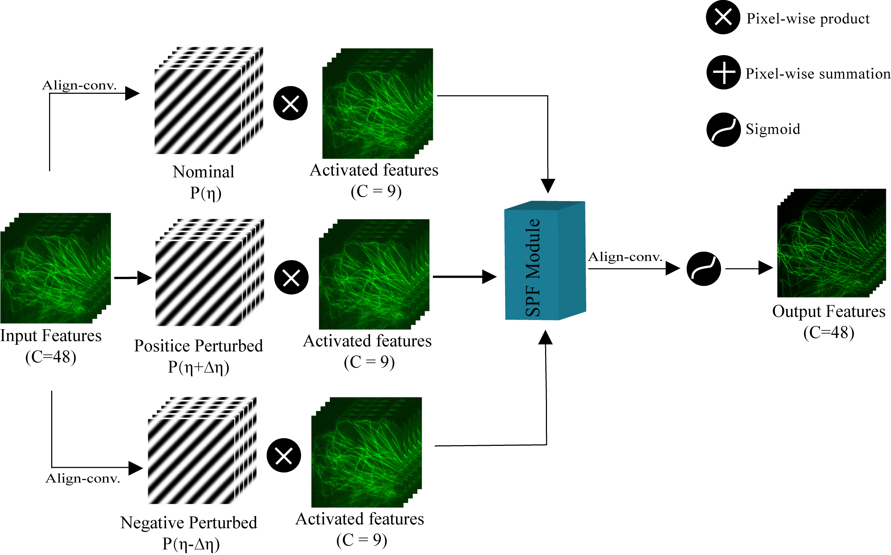

# DART-SIM

DART-SIM is a deep-learning reconstruction framework for 2D structured illumination microscopy (SIM). The current implementation uses a PR-PPF (Pattern-Robust Pattern Prior Fusion) module to improve robustness to illumination-parameter perturbations.

## Method Overview




## Project Structure

```text
DART_SIM_data/      Dataset loading and augmentation
DART_SIM_dst/       Data conversion and SIM parameter helpers
DART_SIM_logic/     Training loop
DART_SIM_model/     DART-SIM network, PR-PPF module, losses
DART_SIM_options/   Training configuration files
Demo/               BioSR and LifeAct training scripts
SIR_core/           Precompiled conventional SIM reconstruction modules
SIR_source/         Utility entry for conventional reconstruction
utils/              MRC I/O, metrics, logging, and general helpers
figs/               Network and PR-PPF figures
```

## Environment

Python 3.10 is recommended. The bundled `SIR_core` binaries include Python 3.8 and Python 3.10 builds.

For CUDA 12.8, install dependencies with:

```bash
pip install --extra-index-url https://download.pytorch.org/whl/cu128 -r requirements.txt
```

The exported environment used in this project includes PyTorch `2.11.0+cu128`.

## Training

BioSR training entry:

```bash
python Demo/Train_DARTSIM_BioSR.py
```

LifeAct zero-shot training entry:

```bash
python Demo/Train_ZeroShot_LifeAct.py
```

Main network names:

```text
dartsim_prppf_mambav2_ft85   Stage-1 training
dartsim_prppf_mambav2_ft70   Stage-2 fine-tuning / inference
```

The corresponding configuration files are:

```text
DART_SIM_options/train_recon2d_dartsim_prppf_mambav2_ft85.json
DART_SIM_options/train_recon2d_dartsim_prppf_mambav2_ft70.json
```

## Notes

- This code is focused on 2D SIM reconstruction.
- Dataset paths in the demo scripts should be updated to match your local data location.
- `SIR_core` contains precompiled binaries, so use a matching Python version when running conventional SIM preprocessing or reconstruction.
